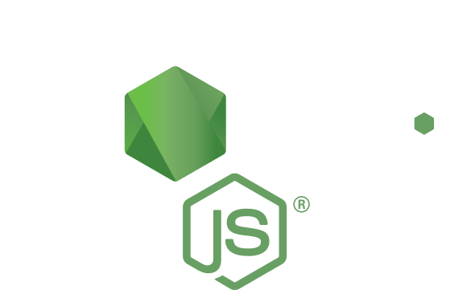

# Build a Node Command Line Interface

A free course on learning how to build a simple command line interface using Node.js and npm.




In this course we'll cover:

* Useful packages for building Node.js command line tools
* How to create a command line tool that automates and simplifies processes
* How to use the command line tool you create insidoe of a project or globally
* How to publish to tools you've created to [npm](https://npmjs.org) for others to install and use.

## Getting Started

1. Sign up for the free course at [Syndri Training](https://syndritraining.com/p/building-a-node-command-line-interface/) when it is available. Alternatively, the videos will also be available on Youtube.

2. A basic understanding of Node.js and npm is needed to complete this course.

3. Make sure to have a text editor installed. We'll be using [Visual Studio Code](https://code.visualstudio.com).

4. As we are building a command line tool, make sure that you have access to a command line interface on your computer.

5. Clone the repository to your local machine:

    ```bash
    # HTTPS
    git clone https://github.com/syndri-training/node-simple-cli.git

    # SSH
    git@github.com:syndri-training/node-simple-cli.git
    ```

## Feedback

We're constantly looking for feedback about course content and subjects. If you like the course or want to see future courses in other subjects, shoot us an email at [info@syndritraining.com](mailto:info@syndritraining.com)